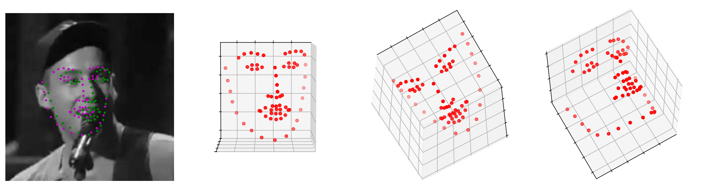

# 3D Facial Alignment

Based on recent advancements in 2D facial landmark detection and work on projection of 2D landmarks into a 3D model, 
we propose a two step architecture for 3D facial alignment through a landmark detection approach. Our experiments 
show that our method outperforms a direct 3D model.
This repo contains an implementation of our method.

## Models

* **Direct 3D Model**


* **2D model with 3D projection**




## Usage

### To train a model:

Modify the `config.json` as needed and run:
 ```
 python train.py -c config.json
 ```

### To evaluate a model:
You can test trained model by running `inference.py` passing path to the trained checkpoint by `--resume` argument.
Example:
  ```
  python inference.py -r path/to/trained_checkpoint
  ```

### Resuming from checkpoints
You can resume from a previously saved checkpoint by:
  ```
  python train.py --resume path/to/checkpoint
  ```

## Folder Structure
  ```
  HandwritingGeneration/
  │
  ├── README.md
  │
  ├── train.py - main script to start training
  ├── inference.py - evaluation of trained model
  │
  ├── config.json  - holds configuration for training a model
  ├── parse_config.py - class to handle config file and cli options
  │
  ├── base/ - abstract base classes
  │   ├── base_data_loader.py
  │   ├── base_model.py
  │   └── base_trainer.py
  │
  ├── data_loader/ 
  │   └── data_loaders.py  - Class to handle the loading of the data
  │
  ├── data/ - default directory for storing input data
  │
  ├── model/ - models, losses, and metrics
  │   ├── models.py
  │   ├── metric.py
  │   └── loss.py
  │
  ├── saved/
  │   ├── figures/ - saved images of output 3D face alignment
  │   ├── models/ - trained models are saved here
  │   └── log/ - logdir for tensorboard and logging output
  │
  ├── trainer/ - trainers
  │   └── trainer.py
  │
  ├── logger/ - module for tensorboard visualization and logging
  │   ├── visualization.py
  │   ├── logger.py
  │   └── logger_config.json
  │  
  └── utils/ - utility functions
      └── util.py
      
  ```